# IMPLEMENTACIÓN DEL ALGORITMO DE DEUTSCH Y DEUTSCH JOSZA

## En esta implementación se encuentran los códigos solución a los problemas del taller:

1. Implemente las 4 funciones posibles de {0,1} a {0,1} usando el computador cuántico de IBM.

Dibujo de función
Matriz correpondiente
Circuito correspondiente
Resultados de las 4 pruebas

2. Verifique que el algoritmos de Deutsch funciona para comprobar cuáles de estas funciones son balanceadas o constantes.

Circuito
Resultados

#### Para el 1 y 2 los archivos: Deutsch 1-4

3. Implemente al menos 4 funciones con n= 4 (3 balanceadas y una constante) para probar el funcionamiento del algoritmo Deustch-Jozsa

Dibujo función
Matriz correspondiente (Generada por computador)
Circuito
Pruebas
Prueba del experimento Deutsch-Jozsa

#### Para el 3 los archivos: DeutschJozaBalanceada y DeutschJozaConstante

# LIBRERÍA DE NÚMEROS COMPLEJOS

## Versión #1: Operaciones Basicas con numeros complejos.

#### Operaciones con números complejos.
#### En esta primera versión de la librería encontramos una serie de operaciones basicas entre numeros complejos, tales como:
#### 1.- Multiplicación
#### 2.- Resta
#### 3.- Suma
#### 4.- División
#### 5.- Módulo
#### 6.- Conjugado 
#### 7.- Conversión entre representaciones polar y cartesiano
#### 8.- Fase

## Versión #2: Operaciones para vectores y Matrices.

#### En esta segunda versión de la librería encontramos operaciones más avanzadas que incluyen vectores y matrices, tales como:

#### 1.- Adición de vectores complejos.
#### 2.- Inverso (aditivo) de un vector complejo.
#### 3.- Multiplicación de un escalar por un vector complejo.
#### 4.- Adición de matrices complejas.
#### 5.- Inversa (aditiva) de una matriz compleja.
#### 6.- Multiplicación de un escalar por una matriz compleja.
#### 7.- Transpuesta de una matriz/vector
#### 8.- Conjugada de una matriz/vector
#### 9.- Adjunta (daga) de una matriz/vector
#### 10.- Producto de dos matrices (de tamaños compatibles)
#### 11.- Función para calcular la "acción" de una matriz sobre un vector.
#### 12.- Producto interno de dos vectores
#### 13.- Norma de un vector
#### 14.- Distancia entre dos vectores
#### 15.- Revisar si una matriz es unitaria
#### 16.- Revisar si una matriz es Hermitiana
#### 17.- Producto tensor de dos matrices/vectores

# PROGRAMA SIMULACIÓN DE LO CLÁSICO A LO CUÁNTICO

#### En esta primera versión del programa de simulación del salto de lo clásico a lo cuántico, encontramos la solución a los experimentos de:

#### 1.- Experimento de las canicas con coeficiente booleanos
#### 2.- Experimentos de las múltiples rendijas clásico probabilístico, con más de dos rendijas.
#### 3.- Experimento de las múltiples rendijas cuántico.
#### 4.- Función para graficar con un diagrama de barras que muestra las probabilidades de un vector de estados.

## Versión N°3: COMPETENCIA DE LA DOBLE RENDIJA
La versión N°3 es una simulación del experimento de la doble rendija. Donde se podrá ver el fenomeno de intererencia y su interpretación con matrices.
                                                 
### Presentado por
Samuel Felipe Díaz M, Andrea Camila Torres González y Andres Serrato

### Docente
Luis Daniel Benavidez Navarro

### Asignatura
CNYT (Ciencias Naturales y Tecnología)

### EXPERIMENTO DOBLE RENDIJA:

Este experimento busca demostrar el comportamiento ondulatorio de la luz que llevo a crear una nueva teoría relacionada con la física cuántica que muestra un fenómeno realmente complejo 

EXPLICACIÓN DEL EXPERIMENTO:

al enviar un haz de luz sobre la doble rendija este interactuara consigo mismo lo cual creara el patrón que conocemos, esto lo explica la física cuántica como la interferencia que tienen los electrones consigo mismos en los múltiples universos posibles lo cual termina generando que el patrón que se puede crear con ondas también lo podamos crear con un haz de luz. 

MATERIALES:

	Papel aluminio 
	Laser 
	Cartulina 
	Bisturí 
	Tabla  

EXPERIMENTO: 

CONSTRUCCIÓN:

Primero se recorto la cartulina de tal forma en la cual se pudiera pegar papel aluminio y a su vez este dejara pasar el haz de luz enviado por un láser, luego de esto se creo una doble rendija con ayuda de un bisturí buscando dejar el espacio suficiente entre estas para que pasara el haz de luz al mismo tiempo, después se colocó una tabla de tal forma que fuera la base de nuestro laser y este pudiera emitir su rayo de una forma constante sobre la doble rendija  

DESARROLLO:

Para iniciar se hizo la demostración cuántica mediante el uso de nuestras librerías simulando una sola rendija, lo cual dio como resultado que existe un 100% de probabilidad de que el rayo laser entre por la única rendija que hay y después existe un 1/3 de probabilidad de tocar los siguientes blancos.  

En donde la dispersión del láser se disminuye, pero la trayectoria se mantiene constante, el primer montaje cuenta de la rendija única y el laser que genera la proyección otra forma de entender el experimento a través de grafos se podría ver de la siguiente manera:

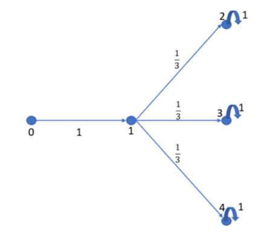

En donde la forma de matriz se aprecia de la siguiente manera:

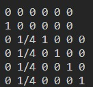

Esto nos demuestra que hay 100 % de probabilidad que entre por la rendija única y después un 25% de tocar cualquiera de lo siguientes blancos y cada uno de los receptores es reflexivo consigo mismo.

### Experimento con 2 rendijas:

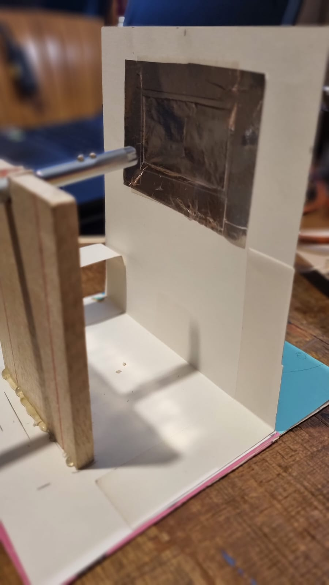

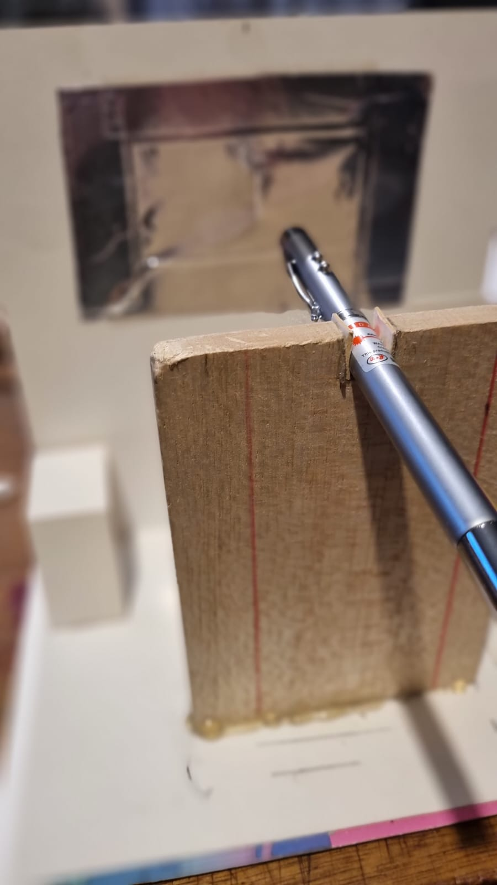

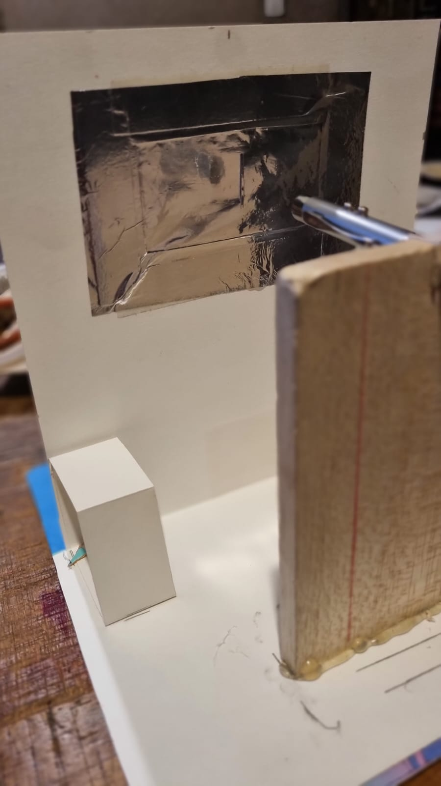

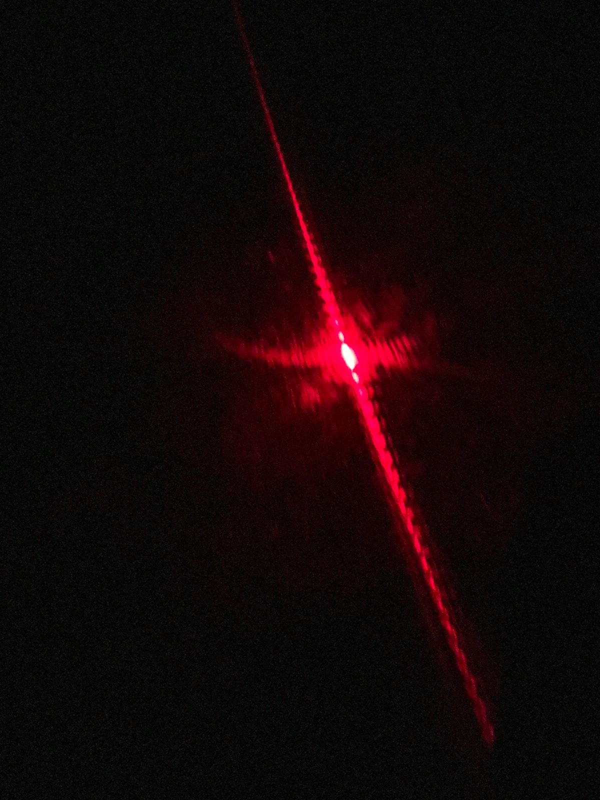

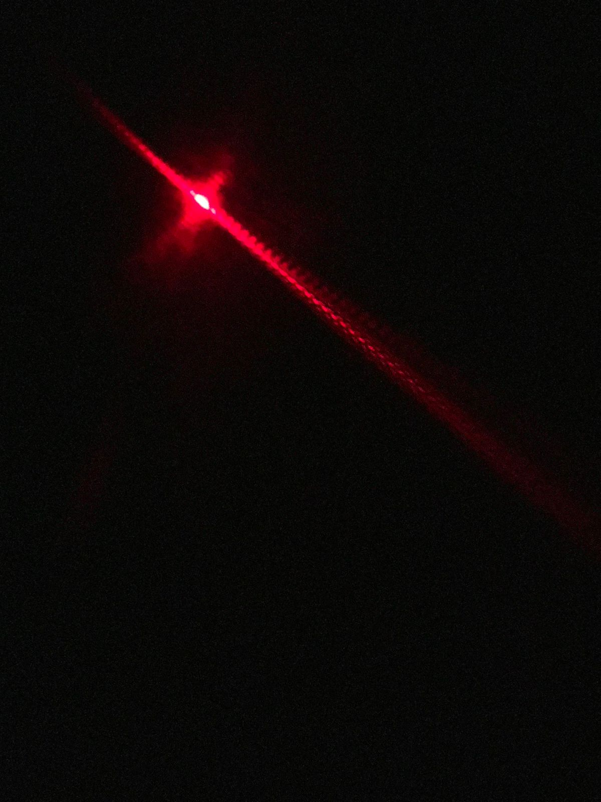

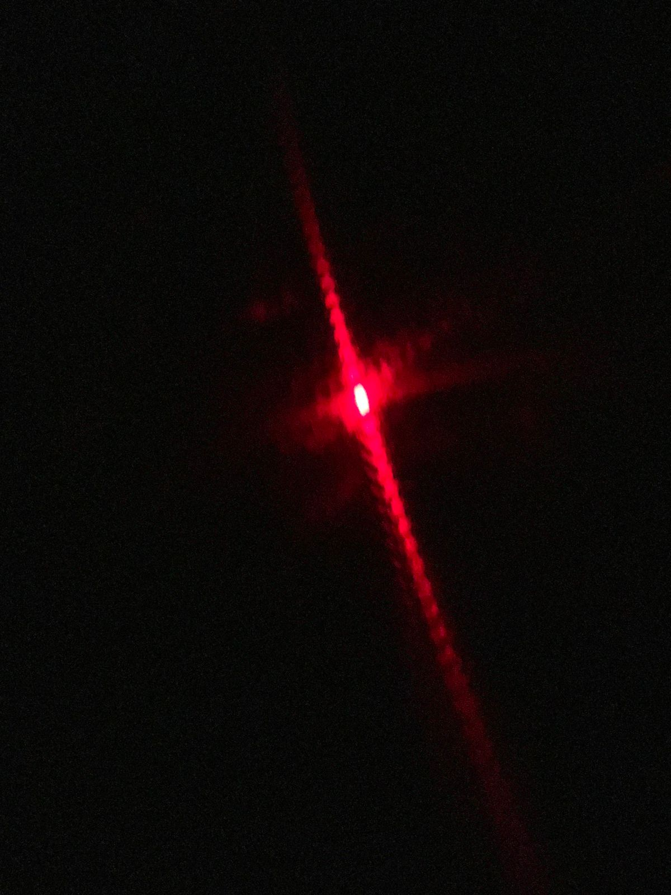

Una manera de poder entender este experimento en forma de grafos sería la siguiente, suponiendo que tenemos 6 receptores:

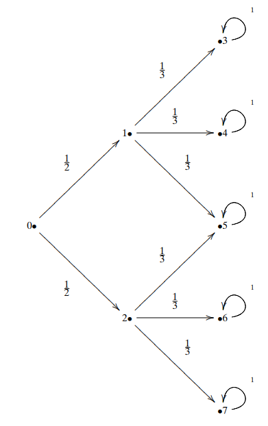

Donde la matriz que representa la dinámica del sistema (teoricamente) sería la siguiente:

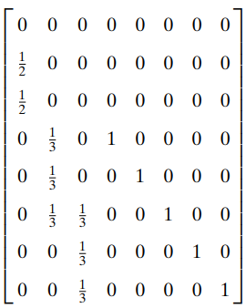

Que en la practica, en codigo se ve de la siguiente manera:

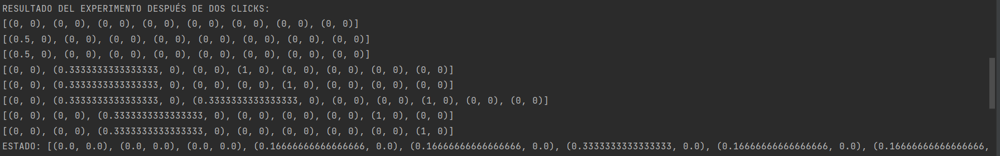

De la cual la probabilidad de estado despues de dos clicks de tiempo sería:

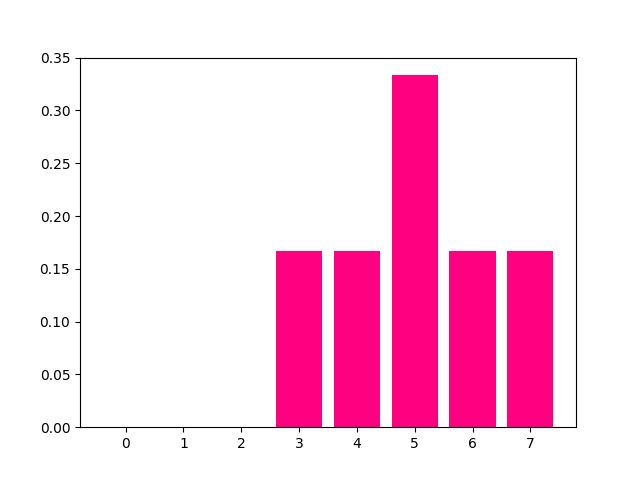

Es decir que tenemos un 50% de probabilidad de que el rayo láser se vaya por alguna de las dos rendijas. Luego de pasar por alguna de las dos rendijas que vendrían a ser los estados 1 y 2 vemos que hay una probabilidad de 1/6 o 16.66 % de que toque alguno de los receptores.

### Simulación con pruebas de doble rendija, con 1, 2 y 3 clicks de tiempo:

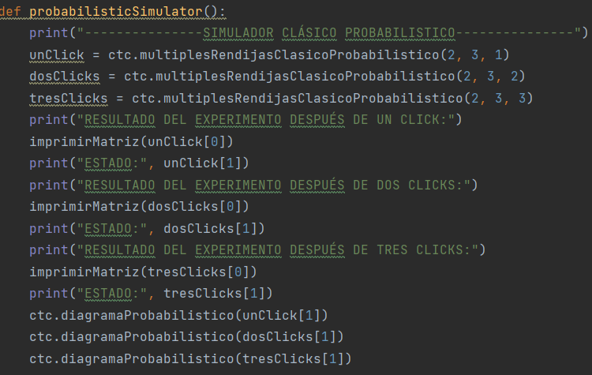
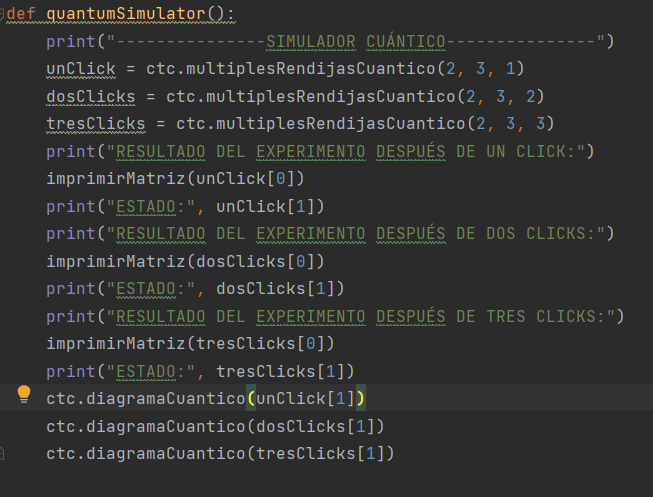
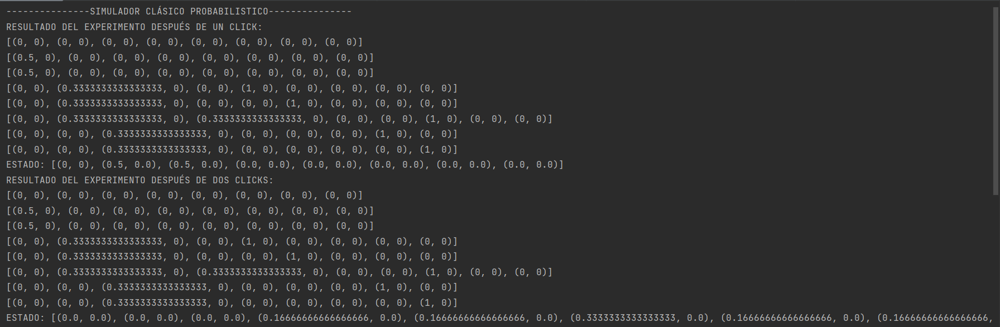
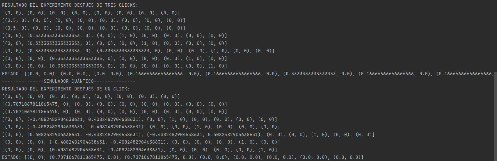
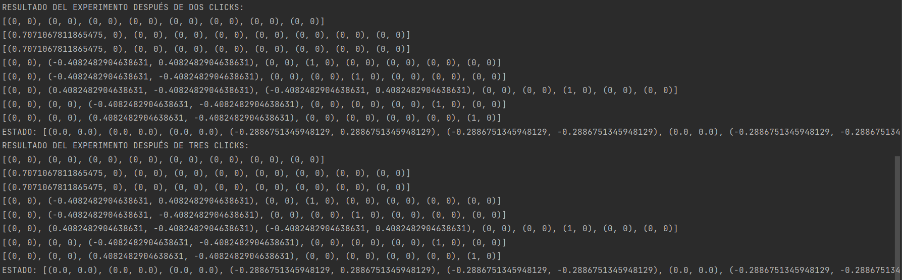

### Resultados clásico probabilistico:

### Resultados cuántico:
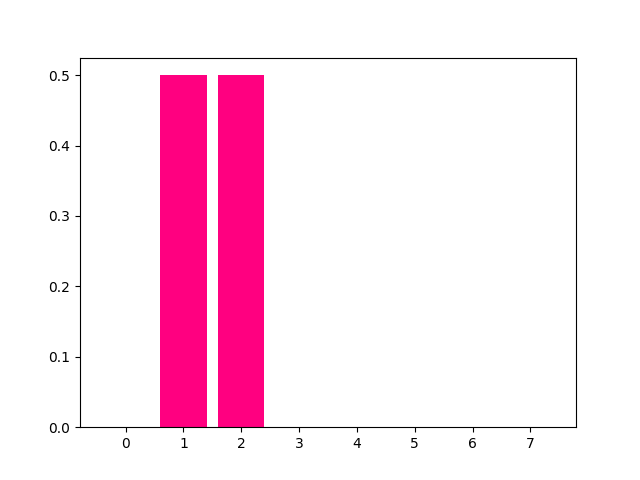
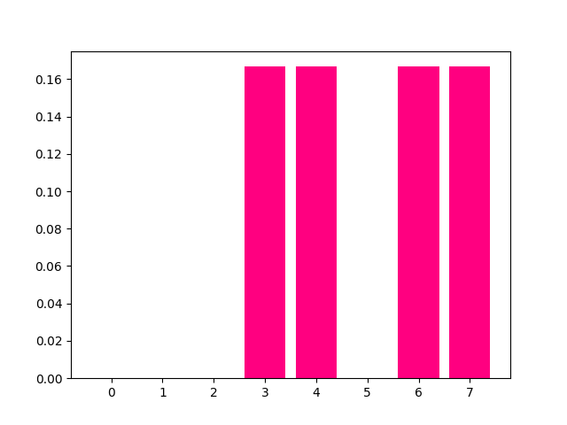

## Desarrollado con:
- Python - Lenguaje de Programación
## Construido con:
- [PyCharm](https://www.jetbrains.com/pycharm/) - IDE de Python
## Autor:
- **Samuel Felipe Díaz** - [*Samuelfdm*](https://github.com/Samuelfdm)
## Agradecimientos:
- #### Profesor Luis Benavidez
- <https://gist.github.com/PurpleBooth/109311bb0361f32d87a2>
- <https://www.youtube.com/watch?v=SWYqp7iY_Tc>
- <https://www.markdownguide.org/>
